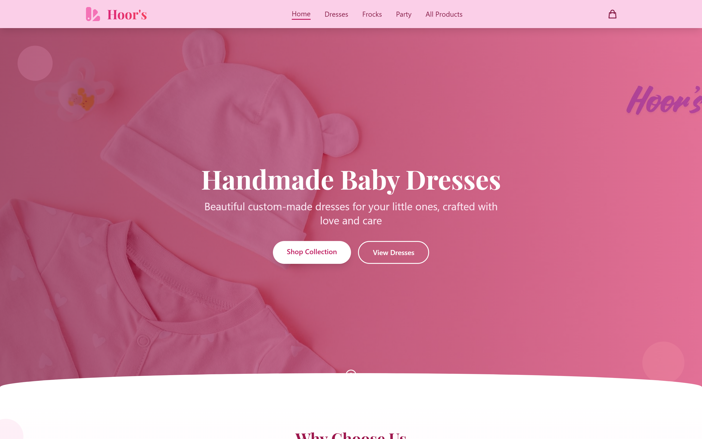

# Hoor's

> A boutique storefront for handcrafted children's dresses, frocks, and party wear — with instant ordering over WhatsApp.


**Hoor's** is a fully responsive single-page storefront for a children's clothing brand. Shoppers can browse a curated catalog by category, open a product to view an image gallery and details, and place an order or request a custom design directly through WhatsApp — no checkout backend required. Built as a fast, frontend-only React + Vite application styled with Tailwind CSS.

<p align="center">
  
</p>

## ✨ Features

- **Category browsing** — dedicated views for Dresses, Frocks, Party wear, and All Products via dynamic routes (`/products/:category`).
- **Product detail pages** — multi-image gallery with thumbnail navigation, star ratings, review counts, descriptions, and itemized product details.
- **WhatsApp ordering** — "Purchase This Product" and "Custom Order" buttons deep-link to WhatsApp with a pre-filled message for the selected item.
- **Cart indicator** — add-to-cart state with a live item count badge in the navbar.
- **Curated home sections** — hero banner, best sellers, new arrivals, feature highlights, testimonials, and a newsletter block.
- **Responsive UI** — mobile menu, adaptive grids, and a Playfair Display / pink-rose brand theme throughout.

## 🛠️ Tech Stack

**Frontend**
- React 19
- Vite 7 (dev server & build)
- React Router DOM 7
- Tailwind CSS 3 (with PostCSS + Autoprefixer)
- ESLint

*This is a frontend-only project — product data is served from a local module and there is no backend/API.*

## 🚀 Getting Started

### Prerequisites
- Node.js 18+ and npm

### Installation
```bash
cd frontend
npm install
```

### Environment variables
None required — the app runs entirely on the client with no API keys or backend services.

### Running locally
```bash
cd frontend
npm run dev
```
The app starts on the Vite dev server at **http://localhost:5173**.

### Production build
```bash
npm run build     # outputs to dist/
npm run preview   # preview the production build locally
```

## 📁 Project Structure

```
Hoor-s-Clothes-brand-/
├── preview.png               # Preview image used in this README
└── frontend/
    ├── index.html
    ├── package.json
    └── src/
        ├── App.jsx           # Router + cart state
        ├── main.jsx
        ├── components/       # Navbar, Hero, BestSellers, NewArrivals,
        │                     # Testimonials, Newsletter, Features,
        │                     # ProductCard, Footer
        ├── pages/            # Home, Products, ProductDetail
        ├── data/             # ProductsData.js (catalog)
        └── utils/            # imageImports.js
```

---

<p align="center">Built by <b>Syed Ibrahim Ali</b> — Full-Stack &amp; AI Engineer</p>
